<h1 align="center">🛒 Productive Families Website</h1>

<p align="center">
  <em>An e-commerce platform that empowers low-income productive families to market and sell their handmade products online — turning dependent families into productive ones that contribute to economic development.</em>
</p>

<p align="center">
  
  
  
  
  
  
</p>

<p align="center">
  <strong>🎓 Graduation Project — Bachelor of Science in Computer Science</strong><br>
  Northern Border University · College of Science · Arar, Kingdom of Saudi Arabia<br>
  <strong>Second Semester · 2020–2021</strong>
</p>

<p align="center">
  <a href="https://roqaya-k7an.github.io/Productive-Families-Website/"><strong>🌐 View the Live Project Showcase »</strong></a>
</p>

---

## 📖 About the Project

Productive families are an important part of our society. They rely on the handicrafts they
produce — including **food, health & beauty products, accessories, handicrafts and clothes** —
often working from home to make different products and market them to meet their needs.

Traditionally these families market their products through social media or paid advertisements,
which is slow, costly, and makes it hard for customers to reach them. **Productive Families
Website** solves this problem by providing a single, simple, and fast online marketplace that
connects productive families directly with clients, increasing their income and contribution to
the economy.

### 🎯 Objectives
- Provide an easy and effective way for productive families to market their products.
- Create an online environment that brings productive families and clients together.
- Save the time and effort families spend marketing products through scattered channels.
- Allow visitors to browse products by category without needing to log in.

---

## ✨ Key Features

The system supports **four types of users**, each with their own dashboard and permissions:

| 👤 Role | Capabilities |
| :--- | :--- |
| **🛠️ Admin** | Manage and view products, productive families, clients, delivery agents and supervisors; delete records; follow up on all operations in the system. |
| **👩‍🍳 Productive Family** | Register and log in; add, edit and delete their products; view and accept/refuse incoming orders. |
| **🛍️ Client** | Register and log in; browse products by category; add items to the cart; send demands and follow up on order status. |
| **🚚 Delivery Agent** | View, accept and cancel delivery orders; manage their account. |

Plus a public storefront where **anyone can browse products** across five categories — **Food,
Health & Beauty, Accessories, Handicrafts, and Clothes** — without signing in.

---

## 🖼️ Screenshots

### Home Page
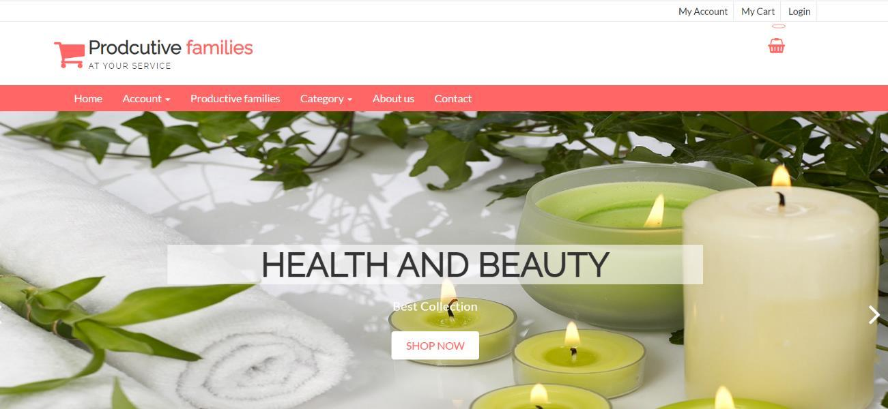
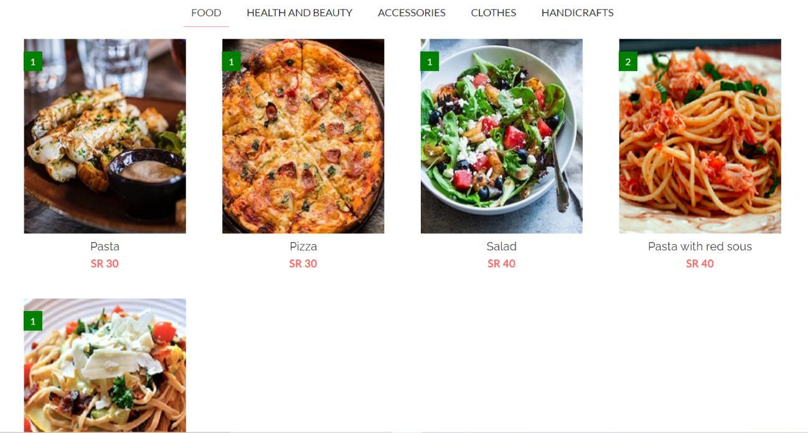

### Authentication
| Login | Productive Family Registration |
| :---: | :---: |
| 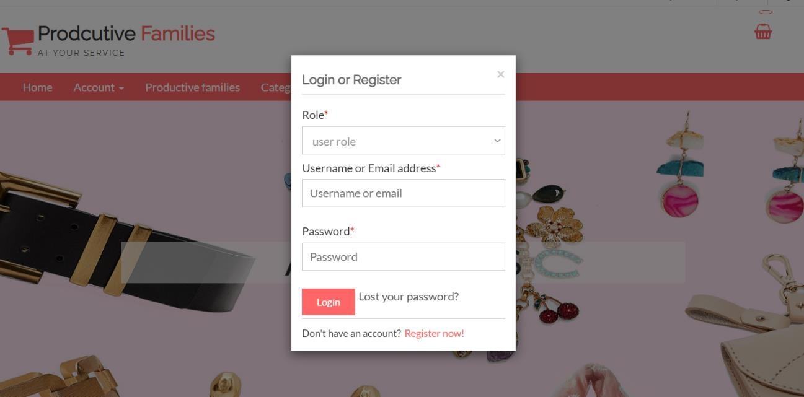 | 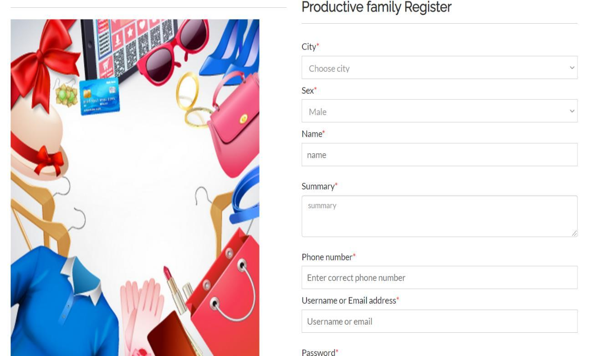 |

### Admin Dashboard
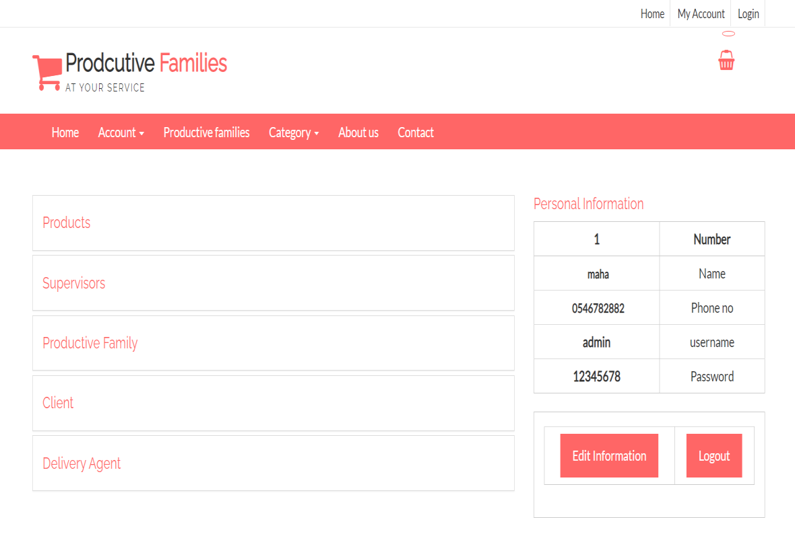

### Productive Family — Product Management
| Manage Products | Add Product | Edit Product |
| :---: | :---: | :---: |
| 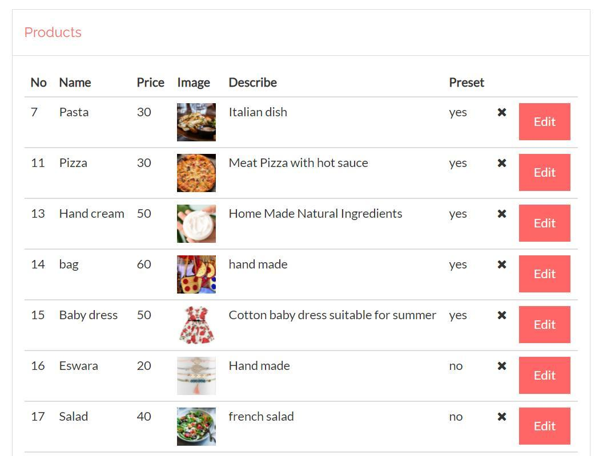 | 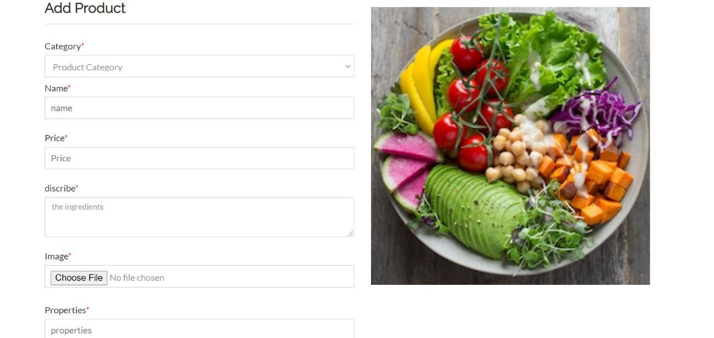 | 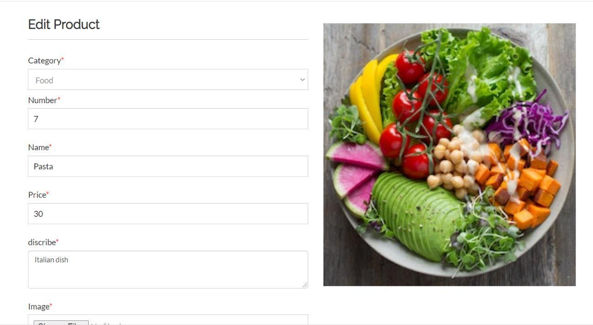 |

### Orders & Requests
| Current Demand | Incoming Requests |
| :---: | :---: |
| 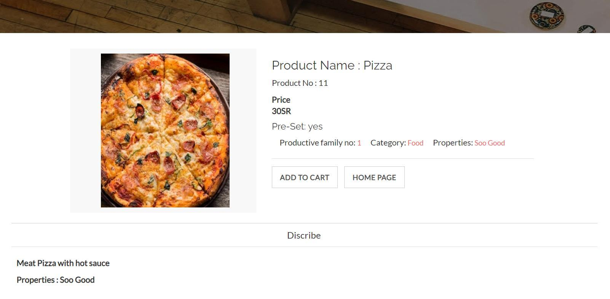 | 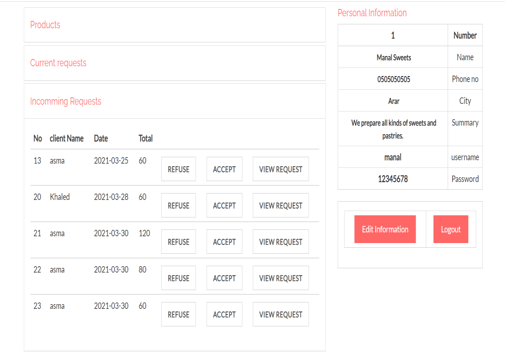 |

### Client Experience
| Browse Products | Shopping Cart | My Requests |
| :---: | :---: | :---: |
| 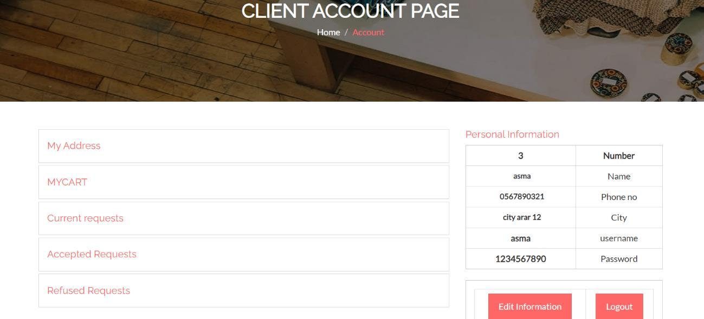 | 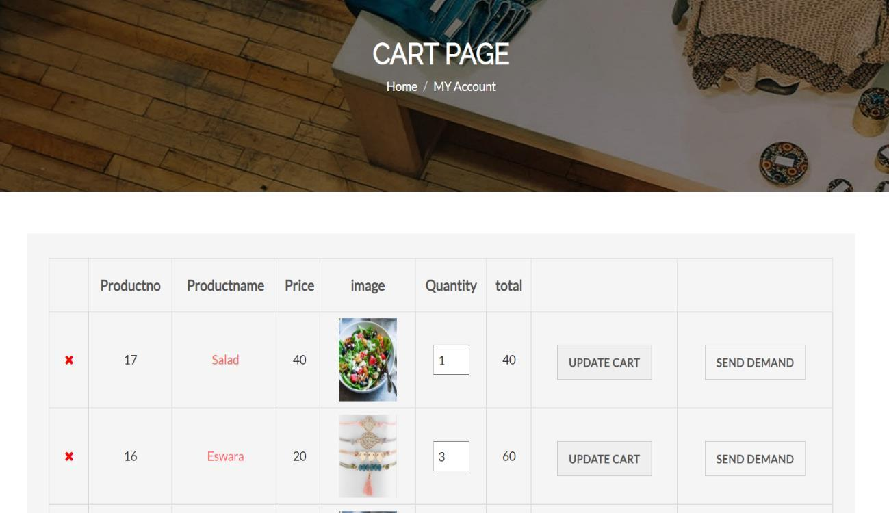 | 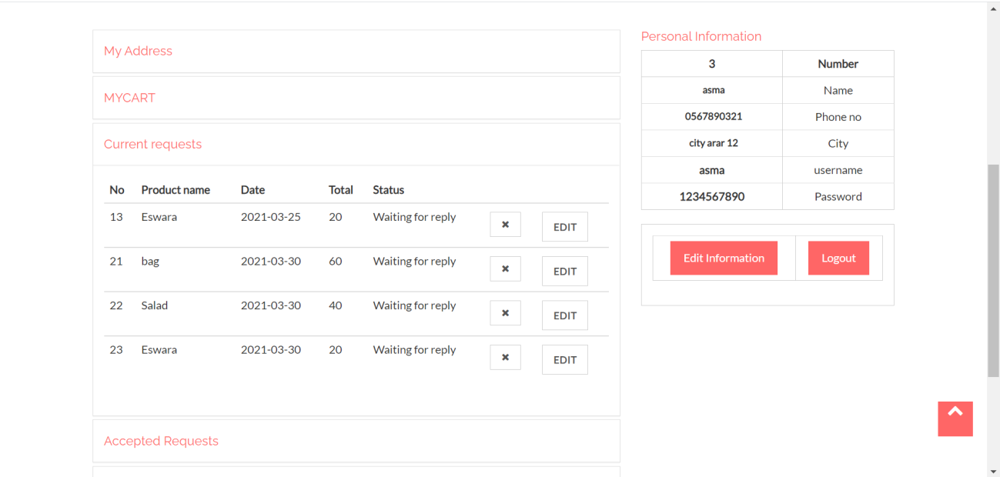 |

### Delivery Agent
| Agent Dashboard | Delivery Requests |
| :---: | :---: |
| 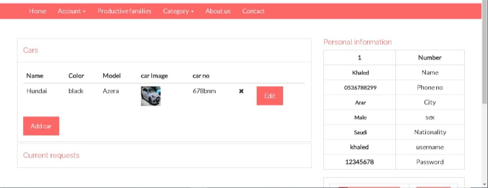 | 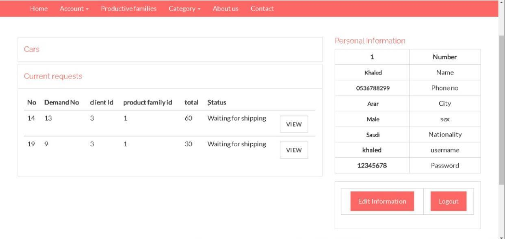 |

---

## 🛠️ Tech Stack

| Layer | Technology |
| :--- | :--- |
| **Front-End** | HTML5, CSS3, Bootstrap, jQuery |
| **Back-End** | PHP |
| **Database** | MySQL |
| **Server** | Apache (XAMPP) |
| **Tools** | Brackets editor, Google Chrome, Microsoft Visio (UML diagrams) |

---

## 🧱 System Design

The project was built following the **Waterfall Software Development Life Cycle (SDLC)**,
progressing through five phases: **Planning & Analysis → Design → Implementation → Testing →
Revision & Submission.**

The analysis and design were documented with **Data Flow Diagrams (DFD), Use Case Diagrams,
Activity & Sequence Diagrams, an Entity Relationship Diagram (ERD), a Class Diagram, and a
Database Schema.**

---

## 🚀 Getting Started (Run Locally)

This is a PHP + MySQL application, so it needs a local server such as **XAMPP**.

1. **Install [XAMPP](https://www.apachefriends.org/)** and start **Apache** and **MySQL**.
2. **Clone this repository** into your `htdocs` folder:
   ```bash
   git clone https://github.com/roqaya-k7an/Productive-Families-Website.git
   ```
3. **Create the database** in [phpMyAdmin](http://localhost/phpmyadmin) and import the project's
   `.sql` file (if provided).
4. **Configure the connection** in `config.php` with your database name, user and password.
5. **Open the site** in your browser:
   ```
   http://localhost/Productive-Families-Website/index.php
   ```

> 💡 The [live link](https://roqaya-k7an.github.io/Productive-Families-Website/) is a static
> showcase of the project. The full interactive system requires a PHP server (XAMPP) as
> described above.

---

## 👩‍💻 Team & Contributors

| Name | University ID | Role |
| :--- | :---: | :--- |
| **Roqaya Mohammed Munir Khan** | 201708987 | Developer |
| **Rhmah Dhwi Makme Al-Anzi** | 201708350 | Developer |
| **Salhah Saud Ghannam Al-Anzi** | 201707851 | Developer |

### 👩‍🏫 Supervisor
**Dr. Asma Ahmed Esmail AL Hashmi**

---

## 🎓 Academic Information

- **Project:** Productive Families Website
- **Degree:** Bachelor of Science — Computer Science
- **University:** Northern Border University, College of Science, Computer Science Department
- **Location:** Arar, Kingdom of Saudi Arabia
- **Course:** Project Course 1105_492
- **Term:** Second Semester, **2020–2021**

---

<p align="center"><em>Submitted in partial fulfillment of the requirements for the degree of Bachelor of Science.</em></p>
